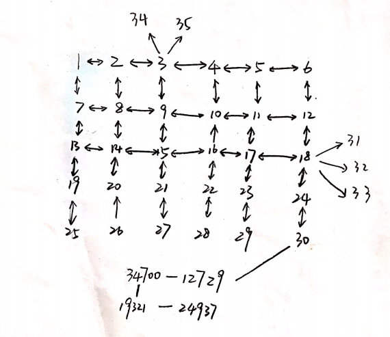

# Table of Contents

1. [Implementation Summary] (README.md#implementation-summary)
2. [Details of Implementation] (README.md#details-of-implementation)
3. [How to Execute] (README.md#how-to-execute)

##Implementation Summary

In this implementation, I realized all of the three features by java. The implementation considered about both the computational complexity and the space complexity. 

To deal with real-time transactions, the algorithm need to give the verification result in a short time, which means we need to lower the computational complexity, in my implementation, I used HaseMap and Hashset to reduce the searching time.

It's highly possible that Paymo would have a large number of users and transactions, thus, we also need to limit the space complexity. In my implementation, each PaymoID only stores it's friends, i.e., first generation friends in a HashSet, most likeky, the average size of the HashSet would not over 1000 ( user may not make transactions with more than 1000 people). 

Due to the short period of time, my implementation is not an optimal case for me. The algorithm can be furthur optimized by reduce the computational complexity and space complexity. For example, in the 'areFourthGenerationFriends' method, we can seperate the 1st generation and 2nd generation friends set to reduce some repeated computing.

Also, additional feature is not implemented yet. There are several features I did thought about:

* `TimeStamp`: For each PaymoID object, add a instance called 'timeStamp' which stores the last update time for this user (i.e., the last transaction time for this user), and for each new transaction, additionally cheack the timeStamp, if it has not been update for long time (maybe 3 month,etc) give 'Unverified' alertto user.

* `LargeNumberTransaction`: Alert user if this transaction number is too large (maybe over $500) and the receiver is not his/her first generation friend.

##Details of implementation

[Back to Table of Contents] (README.md#table-of-contents)

In my implementation, there are  classes:

* `Main`: Main class that will call other classes or methods.
* `PaymoID`: A Paymo ID class, create for each user id, includes a HashSet stores all the 1st generation friends and other methods
* `Users`: An Users object can be regarded as a user datebase, includes a HashMap 'existIds' stores all <ID NO., PaymoID> and other methods
* `ExistTransactionReader`: A reader that will read all transactions from batch_payments file
* `NewTransactionReader`: A reader that will read new transactions from stream_payments file and print result to output*.txt

The followings are detail for each feature's implementations:
	
### Feature 1

Users class provides an 'areFriends' method, it will check if user2 (receiver) is the 1st generation friend of user1(sender).

### Feature 2

Users class provides an 'areSecondGenerationFriends' method, it will check if user1 and user2 are friends by calling 'areFriends' method frist, then check if user1 and user 2 have common friends (i.e., check if there is any common element in their friends HashSet)

### Feature 3

Users class provides an 'areFourthGenarationFriends' method, it will check if user1 and user2 are friends or 2nd genaration friends first by calling the mothods above, then it will create two HashSet: one for all user1's 1st and 2nd generation friends and one for user2's. Then it will check if there is any common friend in their 2nd generation friends set. if so, they are 4th generation friends.

This algorithm is derive from bidirectional BFS, and it will significantly reduce the search time (the computational complexity) from k^4 to k^2 in the worst case.

##How to Execute

In this implementation, there are 2 libirary need to be added: Opencsv and Common-lang, both of these .jar files are stored in the /src folder and will be automatically added by 'run.sh'

In the /paymo_input folder, there are two files: batch_payments.txt and stream_payments.txt, both of files can be replaced by same name files (please note that it has to be .txt file, if it's .csv file, simply change the extend to .txt). These two files are my simplified test cases.(The initial transaction network is shown as below)

To check the result, execute the run_test.sh in /insight_testsuit directory.

